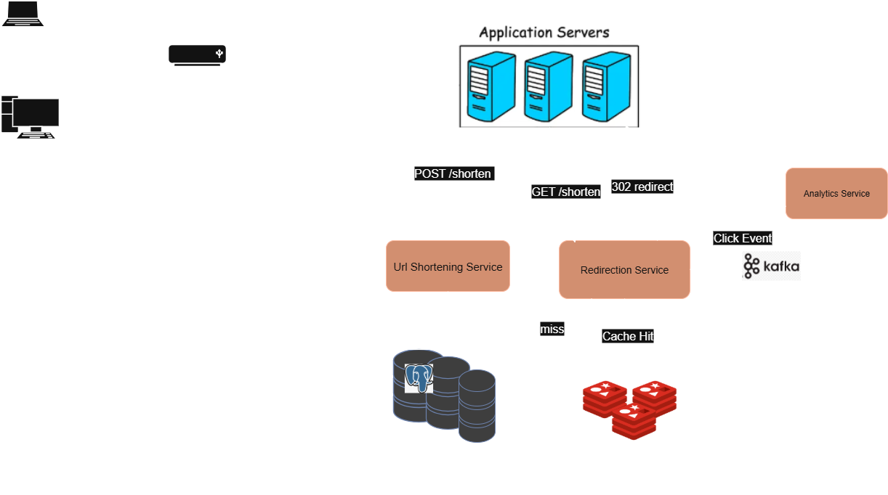

# URL Shortener  

A **URL shortener** is a system (or service) that takes a long URL like:  
https://www.example.com/products/category/electronics/laptops/dell-xps-15
and converts it into a much shorter version, such as:  
https://short.ly/abc123


This project is a **URL shortening system built with ASP.NET Core**, following **Clean Architecture** and **CQRS (Command Query Responsibility Segregation)** principles.  

---

## 📐 System Design  

### 1. Requirements Gathering  

#### Functional Requirements  
- Given a long URL, the service should generate a shorter and unique alias for it.  
- When the user hits a short link, the service should redirect to the original link.  
- Links will expire after a standard default time span.  
- Provide analytics on link usage (optional).  

#### Non-Functional Requirements  
- **High Availability** – If the service goes down, redirections fail.  
- **Low Latency** – Redirection should happen in real-time.  
- **Security & Randomness** – Shortened links must not be predictable.  

---

### 2. Capacity Estimation  

#### Assumptions  
- New URLs shortened per month: **100M** (≈ 3.3M/day, ≈ 38/sec average, peak ~1K/sec).  
- Read (redirect) vs write ratio: **100:1** (heavily read-heavy).  
- Average long URL length: **100 bytes**.  
- Short URL length: **7 characters** (Base62, ~3.5 trillion capacity).  
- Retention: URLs never expire (worst case).  
- Storage horizon: **5 years**.  

#### Storage Estimation  
Each record ≈ 200 bytes (including indexing).  

- 100M URLs/month → ≈ **18.6 GB/month**  
- 6B URLs in 5 years → ≈ **1.2 TB total**  

#### Traffic Estimation  
- Writes: ~38/sec (peak 1K/sec).  
- Reads (redirects): ~100K/sec (peak).  
- System is **read-heavy** → caching + replicas required.  

#### Bandwidth Estimation  
- Redirect Response Size: ~500 bytes  
- Total read bandwidth/day: **~50 GB/day**  
- Peak: ~6 MB/sec  

---

### 3. Capacity Planning  
- Peak traffic: ~12,000 RPS  
- Bandwidth: ~50 GB/day  
- Cache hit ratio: ~80% with Redis  

---

### 4. High-Level Design (HLD)  
  

---

### 5. Sequence Diagrams  
- Shortening a URL (Write Path)  
.png)  

- Redirecting a URL (Read Path)  
.png)  

---

## ⚙️ Implementation in ASP.NET Core  

This project demonstrates how the above design is realized in a real system using **.NET 8 + Clean Architecture + CQRS + MediatR**.  

It is a **simplified version** of the large-scale design:  
- No **API Gateway** or **external load balancer**.  
- No **Kafka** or distributed queue (handled instead using **Domain Events** + **Background Jobs** to simulate async processing).  
- Scaled down to run locally with Dockerized PostgreSQL shards + Redis.  

### 🔑 Key Features Implemented  
- **Sharding with PostgreSQL** → Simulated using Docker containers.  
- **Consistent Hashing** → Distributes URLs across shards.  
- **Short Code Generation** → Base62 encoding + XOR with a secret key to ensure unique and non-sequential short codes, preventing predictability. 
- **Cache-Aside Pattern** → Redis cache to reduce DB load on redirects.    
- **Rate Limiting** → Implemented with **Token Bucket Algorithm** to prevent abuse.  
- **Domain Events (MediatR) + Background Jobs (Hangfire)** → Decouples workflows. When a new URL is created, a UrlCreated domain event triggers asynchronous tasks such as updating user statistics and recording analytics.   
- **Global Error Handling** → Standardized API error responses.  
- **Authentication & Authorization** → JWT + refresh tokens.  
- **Analytics Module** → Tracks clicks, top URLs, summaries per user.  


---

## 🛠️ Tech Stack  
- **Backend**: ASP.NET Core 8, EF Core  
- **Database**: SQL Server (main), PostgreSQL (shards)  
- **Caching**: Redis   
- **Background Jobs**: Hangfire   
- **Architecture**: Clean Architecture, CQRS, Domain Events, Cache-Aside Pattern


---
## ⚙️ Requirements & Setup

### ✅ Requirements
Make sure you have the following installed:

- [.NET 8 SDK](https://dotnet.microsoft.com/download/dotnet/8.0)  
- [SQL Server](https://www.microsoft.com/en-us/sql-server/sql-server-downloads) (for main DB)  
- [PostgreSQL](https://www.postgresql.org/) (running in Docker for sharding)  
- [Redis](https://redis.io/) (running in Docker for caching)  
- [Visual Studio 2022](https://visualstudio.microsoft.com/) or [Visual Studio Code](https://code.visualstudio.com/)  
- [Docker Desktop](https://www.docker.com/products/docker-desktop)  


### 🚀 Setup Steps

1. **Clone the repository**
   ```bash
   git clone https://github.com/your-username/Url-Shortener.git
   cd Url-Shortener
   ```

2. **Run PostgreSQL shards in Docker**  
You need 3 shard containers running on different ports:  
```bash
docker run --name shard1 -e POSTGRES_USER=admin -e POSTGRES_PASSWORD=admin -e POSTGRES_DB=Urls -p 5435:5432 -d postgres:15
docker run --name shard2 -e POSTGRES_USER=admin -e POSTGRES_PASSWORD=admin -e POSTGRES_DB=Urls -p 5434:5432 -d postgres:15
docker run --name shard3 -e POSTGRES_USER=admin -e POSTGRES_PASSWORD=admin -e POSTGRES_DB=Urls -p 5433:5432 -d postgres:15
```

3. **Run Redis in Docker**  
Start a Redis container to be used for caching:  
```bash
docker run --name redis -p 6379:6379 -d redis

```


4. **Configure appsettings.json**
Update src/UrlShortener.Api/appsettings.json with your own values:
```json
{
  "ConnectionStrings": {
    "DefaultConnectionString": "Server=.;Database=UrlShortener;Integrated Security=True;TrustServerCertificate=True;MultipleActiveResultSets=True",
    "Redis": "localhost:6379,abortConnect=false"
  },
  "Shards": [
    { "Name": "shard1", "ConnectionString": "Host=localhost;Port=5435;Username=admin;Password=admin;Database=Urls" },
    { "Name": "shard2", "ConnectionString": "Host=localhost;Port=5434;Username=admin;Password=admin;Database=Urls" },
    { "Name": "shard3", "ConnectionString": "Host=localhost;Port=5433;Username=admin;Password=admin;Database=Urls" }
  ],
  "JwtOptions": {
    "Issuer": "https://localhost:7084",
    "Audience": "Audience",
    "SecretKey": "your-super-secret-key",
    "ExpirationInHours": "1"
  },
  "SmtpOptions": {
    "Host": "smtp.gmail.com",
    "Port": 587,
    "UserName": "your-email@gmail.com",
    "Password": "your-email-password",
    "EnableSsl": true
  },
  "Shortener": {
    "SecretKey": 998,
    "BaseUrl": "https://localhost:7084"
  }
}


```
5. **Apply EF Core migrations for the main SQL Server database**
```bash
dotnet ef database update --project src/UrlShortener.Infrastructure --startup-project src/UrlShortener.Api

```

6. **Run the API**
```bash
cd src/UrlShortener.Api
dotnet run
```

---

## 🚀 Endpoints  

### **Authentication**  
- `POST /api/auth/register`  
- `GET /api/auth/confirm-email`  
- `POST /api/auth/resend-confirmation`  
- `POST /api/auth/login`  
- `POST /api/auth/logout`  
- `POST /api/auth/refresh-access`  

### **URLs**  
- `POST /api/Urls/shorten`  
- `GET /api/Urls/mine` → Get user URLs (paginated & filtered).  
- `GET /api/Urls/{shortUrl}/clicks`  
- `PATCH /api/Urls/{shortCode}`  
- `DELETE /api/Urls/{shortUrl}`  
- `GET /api/Urls/{shortUrl}`  

### **Redirect**  
- `GET /{shortCode}` → Redirects to original URL.  

### **Analytics**  
- `GET /api/Analytics/summary`  
- `GET /api/Analytics/top-urls` → Returns top N URLs for a user.  


 

